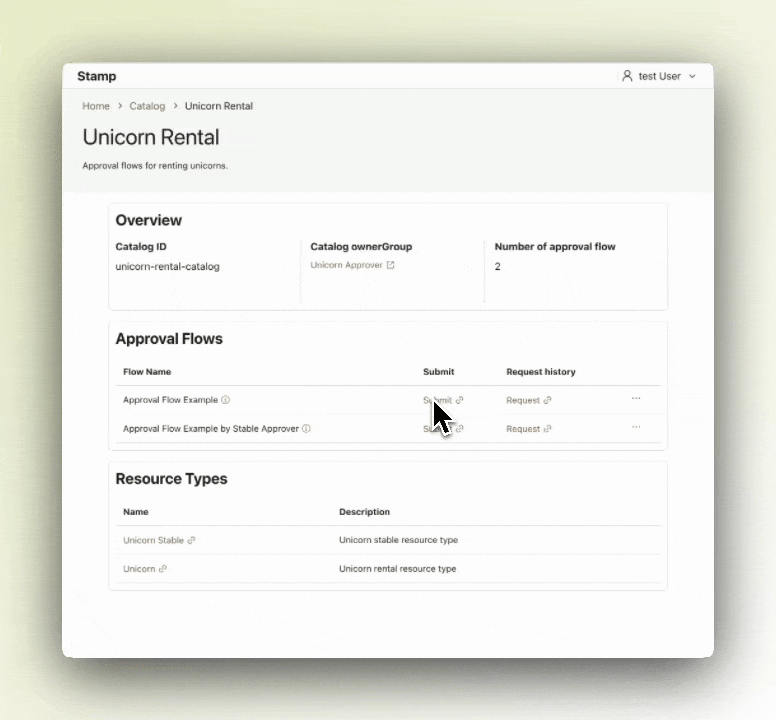

# Stamp

Stamp is an approval request workflow management tool that facilitates the submission, approval, and revocation of requests. It monitors the status of each request and initiates subsequent workflows upon approval.

Currently, it offers workflows for IAM Identity Center and IAM Role permission elevation and can be extended with custom integrations.

  

## Features

- Manage approval requests (submission, approval, and revocation)
- Approve requests via web interface or Slack
- Integrate with other systems through custom code
- Track and trigger downstream actions following approvals

## Predefined Approval Workflow Catalogs

Stamp organizes approval workflows into **Catalogs** based on integrations. Each Catalog is located in the `/catalogs` directory and includes configurations for specific approval processes.

| Catalog Name        | Description                                                                                       | Path                 |
| ------------------- | ------------------------------------------------------------------------------------------------- | -------------------- |
| IAM Identity Center | Manages and elevates permissions using AWS IAM Identity Center seamlessly.                        | `/catalogs/iam-idc`  |
| IAM Role            | Handles temporary IAM Role permissions with integrated approval steps and supports GitHub's OIDC. | `/catalogs/iam-role` |
| Custom Integrations | Extends Stamp by integrating with other systems through customizable workflows.                   |                      |

Please refer to [How to Develop for Stamp Catalog](docs/development/how-to-develop-stamp-catalog.md) for developing custom integrations.

## Get Started

Stamp can be deployed using AWS DynamoDB, Amazon Cognito, and AWS container services such as ECS and AppRunner.

### Local Execution

To get started with local development:

Refer to [the Web UI documentation](apps/web-ui/README.md) for setup and running the application locally.

### IAM Identity Center Catalog

To deploy using the IAM Identity Center Catalog features:

- Follow the [deployment documentation](docs/operation/deployment-with-iam-idc-catalog.md).
- For usage instructions, consult [this guide](docs/user-guide/how-to-submit-iam-idc-catalog.md).

## Contributing

Thank you for contributing to Stamp. Your support helps us improve and grow the project.

### Reporting Bugs

Please submit bug reports through [GitHub Issues](https://github.com/sony/stamp/issues/new?template=bug_report.md).

### Asking Questions

For inquiries, use [GitHub Discussions](https://github.com/sony/stamp/discussions/categories/q-a).

### Feature Request

If you have a feature request, please let us know at [here](https://github.com/sony/stamp/discussions/new?category=feature-request)

### Pull Requests

Please submit pull requests to the main branch. Maintainers will review your contributions.
