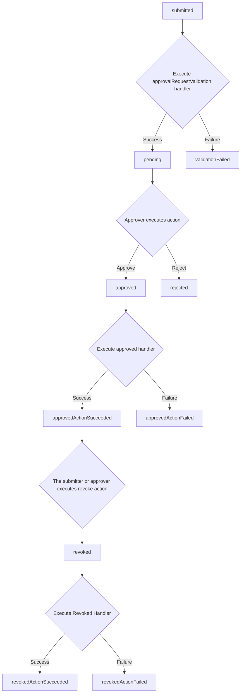

# How to Develop for Stamp Catalog

## Get Started

### How to Create a Catalog

Each Catalog consists of:

- **ResourceType**: Defines the types of resources and permissions managed.
- **ApprovalFlow**: Outlines the steps and conditions for granting approvals.

By defining the following, you can create a Stamp catalog and establish your own resources and approval flows.

To create a Stamp catalog, you need to define various configurations that outline your resources and the approval processes associated with them.

```ts
import { createLogger } from "@stamp-lib/stamp-logger";
import { none, some } from "@stamp-lib/stamp-option";
import { ApprovalFlowHandler, HandlerError, ResourceHandlers } from "@stamp-lib/stamp-types/catalogInterface/handler";
import { ApprovalFlowConfig, CatalogConfig, ResourceTypeConfig } from "@stamp-lib/stamp-types/models";
import { err, ok } from "neverthrow";

const logger = createLogger("DEBUG", { moduleName: "unicorn-rental" });

const unicornMap = new Map<string, { name: string; age: number; favoriteFood: string[] }>();

const unicornResourceHandler: ResourceHandlers = {
  createResource: async (input) => {
    const id = globalThis.crypto.randomUUID();
    const unicornData = {
      name: input.inputParams.name as string,
      age: input.inputParams.age as number,
      favoriteFood: input.inputParams.favoriteFood as string[],
    };
    unicornMap.set(id, unicornData);
    return ok({
      resourceId: id,
      name: stableData.name,
      params: {
        name: unicornData.name,
        age: unicornData.age,
        favoriteFood: unicornData.favoriteFood,
      },
    });
  },
  deleteResource: async (input) => {
    unicornMap.delete(input.resourceId);
    return ok(undefined);
  },
  getResource: async (input) => {
    const unicornData = unicornMap.get(input.resourceId);
    if (unicornData === undefined) {
      return ok(none);
    }
    return ok(
      some({
        resourceId: input.resourceId,
        name: stableData.name,
        params: {
          color: stableData.color,
          age: stableData.age,
        },
        parentResourceId: stableData.stableId,
      })
    );
  },
  listResources: async (input) => {
    logger.info("list", input);
    const resources = [];
    for (const [id, unicorn] of unicornMap.entries()) {
      if (input.parentResourceId !== undefined && input.parentResourceId !== unicorn.stableId) {
        continue;
      }
      resources.push({
        resourceId: id,
        name: unicorn.name,
        params: {
          color: unicorn.color,
          age: unicorn.age,
          favoriteFood: unicorn.favoriteFood,
        },
        parentResourceId: unicorn.stableId,
      });
    }
    return ok({ resources });
  },
  updateResource: async (input) => {
    return err(new HandlerError("not implemented", "INTERNAL_SERVER_ERROR"));
  },
  listResourceAuditItem: async (input) => {
    return ok({ auditItems: [] });
  },
};

const unicornRentalApplicationHandler: ApprovalFlowHandler = {
  approvalRequestValidation: async (input) => {
    // Write the process to execute after the request is submitted
    logger.info("approvalRequestValidation", input);
    return ok({ isSuccess: true, message: "Unicorn rental request." });
  },
  approved: async (input) => {
    // Write the process to execute after the request is approved
    logger.info("approved", input);
    return ok({ isSuccess: true, message: "approved unicorn rental" });
  },
  revoked: async (input) => {
    // Write the process to execute after the request is revoked
    logger.info("revoked", input);
    return ok({ isSuccess: true, message: "revoked unicorn rental" });
  },
};

const unicornResourceType: ResourceTypeConfig = {
  id: "unicorn",
  name: "Unicorn",
  description: "Unicorn rental resource type",
  createParams: [
    { type: "string", id: "name", name: "Name", required: true },
    { type: "number", id: "age", name: "Age", required: true },
    {
      type: "string[]",
      id: "favoriteFood",
      name: "Favorite Food",
      required: false,
    },
  ],
  infoParams: [
    { type: "number", id: "age", name: "Age", edit: false },
    {
      type: "string[]",
      id: "favoriteFood",
      name: "Favorite Food",
      edit: false,
    },
  ],
  handlers: unicornRentalResourceHandler,
  isCreatable: true,
  isUpdatable: false,
  isDeletable: true,
  ownerManagement: false,
  approverManagement: false,
};

const unicornRentalApplicationConfig: ApprovalFlowConfig = {
  id: "unicorn-rental-application",
  name: "Unicorn Rental Application",
  description: "This is an unicorn rental application flow.",
  inputParams: [{ type: "number", id: "days", name: "Days", required: true }],
  inputResources: [{ resourceTypeId: "unicorn" }],
  approver: { approverType: "approvalFlow" },
  handlers: unicornRentalApplicationHandler,
  enableRevoke: true,
};

export const unicornRentalCatalog: CatalogConfig = {
  id: "unicorn-rental-catalog",
  name: "Unicorn Rental",
  description: "Approval flows for renting unicorns.",
  approvalFlows: [unicornRentalApplicationConfig],
  resourceTypes: [unicornResourceType],
};
```

In this example, we create a `ResourceType` named `unicorn` and an `ApprovalFlow` named `Unicorn Rental Application`.
The unicorn resource allows you to set `name`, `age`, and `favoriteFood` upon creation.
The Unicorn Rental Application enables you to select `days` and a `unicorn` when applying.

This setup demonstrates how to define a custom resource type (`unicorn`) with specific attributes and how to create an approval flow that manages rental applications for these unicorns.

Then, by specifying `unicornRentalCatalog` in the `createConfigProvider` within the entry point to start the Stamp server (e.g., `apps/web-ui/custom-server/index.ts`), you can add the catalog to Stamp.

```ts
const dynamodbDB = createDynamodbDBPlugin({
  region: "us-west-2",
  tableNamePrefix: process.env.DYNAMO_TABLE_PREFIX!,
  logLevel: logLevel,
});

const dynamodBIdentity = createDynamodbIdentityPlugin({
  region: "us-west-2",
  tableNamePrefix: process.env.DYNAMO_TABLE_PREFIX!,
  logLevel: logLevel,
});

const config = await createConfigProvider({
  catalogs: [unicornRentalCatalog],
});

createStampHubHTTPServer({ db: dynamodbDB, config: config, identity: dynamodBIdentity }, 4000);
```

## Parameters

### ResourceTypeConfig

| Field                 | Type                    | Required | Constraints                | Description                                                                                   |
| --------------------- | ----------------------- | -------- | -------------------------- | --------------------------------------------------------------------------------------------- |
| id                    | `ResourceTypeId`        | Yes      | String of 1-128 characters | An arbitrary ID that represents the resource type. This ID must be unique within the Catalog. |
| name                  | `string`                | Yes      | Maximum 128 characters     | The name of the resource type.                                                                |
| description           | `string`                | Yes      | Maximum 256 characters     | A description of the resource type.                                                           |
| createParams          | `ResourceCreateParam[]` | Yes      | Max 10 items               | Input parameters required when creating the resource.                                         |
| infoParams            | `ResourceInfoParam[]`   | Yes      | Max 10 items               | Parameters that need to be displayed for the resource information.                            |
| handlers              | `ResourceHandlers`      | Yes      | -                          | Handler functions that are invoked during resource operations.                                |
| parentResourceTypeId? | `string`                | No       | -                          | The ID of the parent resource type, if any.                                                   |
| isCreatable           | `boolean`               | Yes      | -                          | Flag that enables the creation of the resource.                                               |
| isUpdatable           | `boolean`               | Yes      | -                          | Flag that determines whether the resource can be updated.                                     |
| isDeletable           | `boolean`               | Yes      | -                          | Flag that allows the resource to be deleted.                                                  |
| ownerManagement       | `boolean`               | Yes      | -                          | Flag that enables the configuration of the Owner Group.                                       |
| approverManagement    | `boolean`               | Yes      | -                          | Flag that enables the configuration of the Approver Group.                                    |
| anyoneCanCreate?      | `boolean`               | No       | -                          | Optional flag that allows anyone to create the resource.                                      |

### ApprovalFlowConfig

| Field           | Type                       | Required | Constraints             | Description                                                                                                                                                                            |
| --------------- | -------------------------- | -------- | ----------------------- | -------------------------------------------------------------------------------------------------------------------------------------------------------------------------------------- |
| id              | `ApprovalFlowId`           | Yes      | String of max 128 chars | An arbitrary ID that represents the Approval Flow. This ID must be unique within the Catalog.                                                                                          |
| name            | `string`                   | Yes      | Maximum 128 characters  | The name of the Approval Flow.                                                                                                                                                         |
| description     | `string`                   | Yes      | Maximum 256 characters  | A description of the Approval Flow.                                                                                                                                                    |
| inputParams     | `ApprovalFlowInputParam[]` | Yes      | Max 5 items             | Input parameters required when submitting an Approval Flow request.                                                                                                                    |
| handlers        | `ApprovalFlowHandler`      | Yes      | -                       | Handler functions that are invoked during Approval Flow operations. Errors are returned using `isSuccess` in `ApprovalRequestValidationOutput`, `ApprovedOutput`, and `RevokedOutput`. |
| inputResources? | `InputResource[]`          | No       | Max 12 items            | Optional resources associated with the Approval Flow request.                                                                                                                          |
| approver        | `Approver`                 | Yes      | -                       | Configuration for the type of approval group. You can choose to set the approver group for the Approval Flow itself or select the approver group configured for the input resources.   |
| enableRevoke?   | `boolean`                  | No       | -                       | Optional flag that enables the revocation of approvals.                                                                                                                                |

**Note:**  
Since Approval Flows cannot be re-executed midway, ensure that they are idempotent. This allows the process to continue upon reapplication even if errors occur during execution.

### CatalogConfig

| Field         | Type                   | Required | Constraints             | Description                                                   |
| ------------- | ---------------------- | -------- | ----------------------- | ------------------------------------------------------------- |
| id            | `CatalogId`            | Yes      | String of max 128 chars | An arbitrary ID that represents the Catalog.                  |
| name          | `string`               | Yes      | Maximum 128 characters  | The name of the Catalog.                                      |
| description   | `string`               | Yes      | Maximum 256 characters  | A description of the Catalog.                                 |
| approvalFlows | `ApprovalFlowConfig[]` | Yes      | Max 12 items            | ApprovalFlowConfig instances that are set within the Catalog. |
| resourceTypes | `ResourceTypeConfig[]` | Yes      | Max 12 items            | ResourceTypeConfig instances that are set within the Catalog. |

## Approval Flow Handler Execution Mechanism

### Approval Request State Machine

The Approval Request State Machine outlines the lifecycle of an approval request, detailing each state and the transitions between them based on handler executions and user actions.



- **submitted**: The initial state when an approval request is created.
- **validation**: The system executes the approvalRequestValidation handler to verify the request details.
  - **Success**: If validation passes, the request moves to the **pending** state.
  - **Failure**: If validation fails, the request transitions to **validationFailed**.
- **pending**: The request awaits action from an approver.
- **ApproverAction**: The approver reviews the request and decides to approve or reject.
  - **Approve**: Moves the request to the **approved** state.
  - **Reject**: Moves the request to the **rejected** state.
- **approved**: The request has been approved and awaits execution.
- **approvedHandler**: The system executes the approved handler.
  - **Success**: Transition to **approvedActionSucceeded**.
  - **Failure**: Transition to **approvedActionFailed**.
- **approvedActionSucceeded**: The approved action was successfully executed.
- **revoke**: The submitter or approver decides to revoke the approval.
- **revoked**: The approval has been revoked.
- **revokedHandler**: The system executes the revoked handler.
  - **Success**: Transition to **revokedActionSucceeded**.
  - **Failure**: Transition to **revokedActionFailed**.
