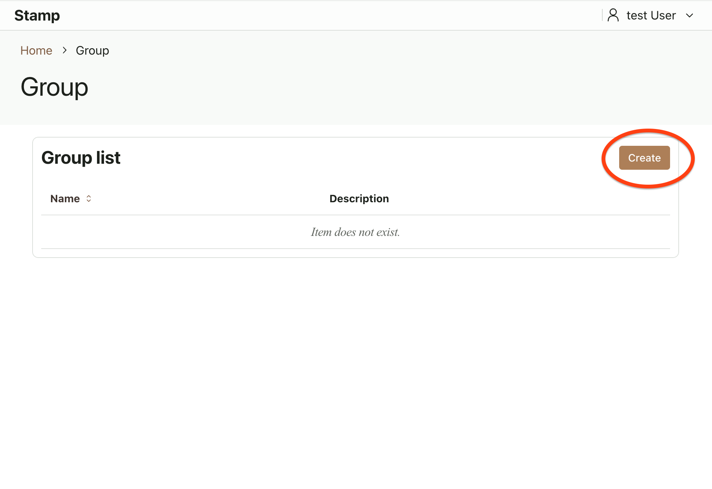
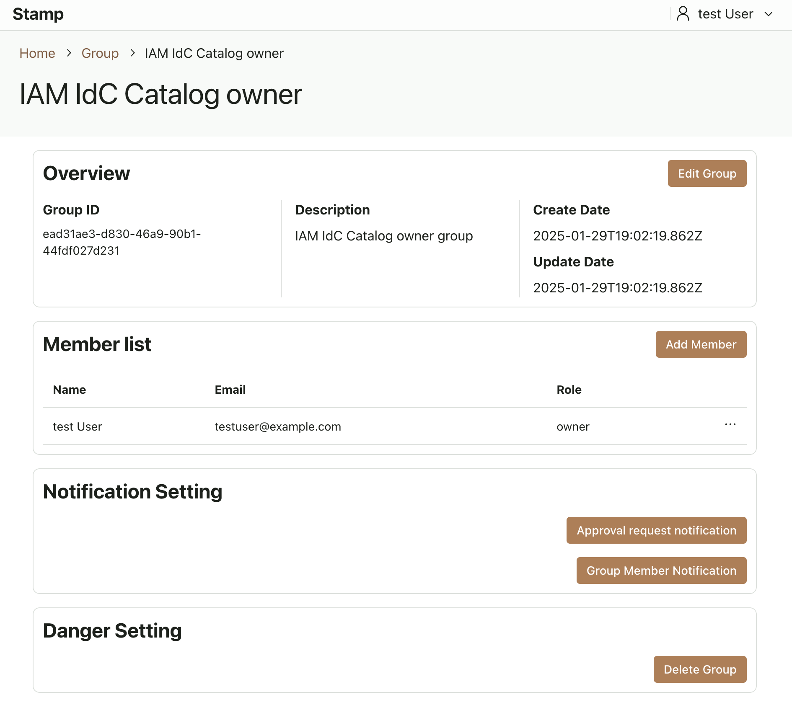
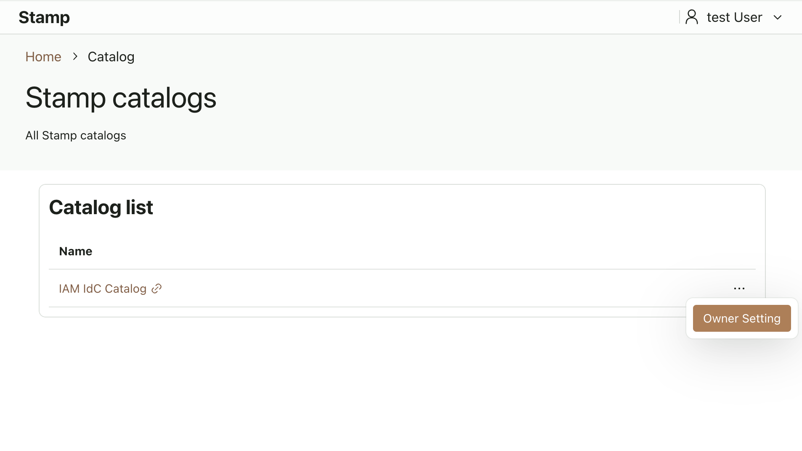
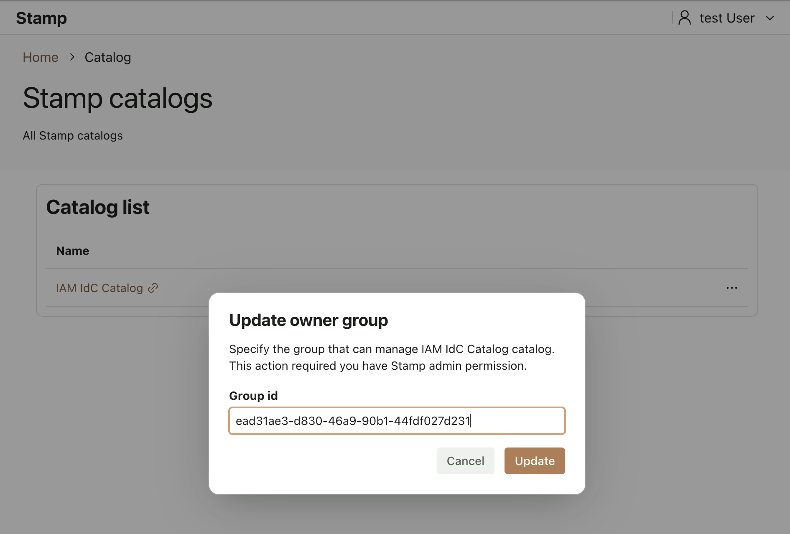

# Deploying Stamp with IAM Identity Center Catalog

This document explains how to deploy Stamp with IAM Identity Center Catalog integration.

## Delegating your IAM Identity Center account

To call IAM Identity Center APIs, Stamp must be deployed to an AWS account that has been delegated as the administration account for IAM Identity Center from the Organizations management account.  
Refer to the following documentation to delegate administration:

[Delegated administration](https://docs.aws.amazon.com/singlesignon/latest/userguide/delegated-admin.html)

## Deploying Cognito user pool

Use the following article to create both your IAM Identity Center application and Amazon Cognito user pool:  
[How do I use an Amazon Cognito user pool to integrate IAM Identity Center?](https://repost.aws/knowledge-center/cognito-user-pool-iam-integration)

Cognito configuration values:

- Sign-in option: Username
- Federated sign-in option: SAML
- Required attributes: name, email
- Enter SAML metadata URL: the “IAM Identity Center SAML Metadata File” URL from the IAM Identity Center application creation screen
- Map attributes between your SAML provider and the user pool:
  - name → name
  - email → email
- First application client:
  - Client type: Confidential client
  - Client name: nextAuth
  - Generate a client secret
  - URL: `https://<your-domain>/api/auth/callback/cognito`

IAM Identity Center application settings:

- Attribute mappings
  - Subject
    - Value: ${user:subject}
    - Format: persistent
  - name
    - Value: ${user:name}
    - Format: basic
  - email
    - Value: ${user:email}
    - Format: basic

Note:  
Users can only sign in to Stamp after being assigned to the newly created IAM Identity Center application.

## Deploying the DynamoDB Plugin

Deploy [dynamodb-db CloudFormation Template](../../plugins/dynamodb-db/cf-template.yaml) and [dynamodb-identity CloudFormation Template](../../plugins/dynamodb-identity/cf-template.yaml).  
Record the TableNamePrefix you specify in the parameters, as it’s used for container environment variables.  
Also record your KMS keys for UserDataKey and SessionDataKey in dynamodb-identity.

## Creating a Slack App

1. Replace `<Stamp domain>` in [manifest](../../plugins/slack/manifest.yml).
2. Create a Slack App using this [manifest](../../plugins/slack/manifest.yml) and install it to your workspace: [Slack Manifest Documentation](https://api.slack.com/reference/manifests)
3. Deploy [cf-template.yaml (slack)](../../plugins/slack/cf-template.yaml) to CloudFormation

Record your Slack credentials:

- Slack bot token
- Slack client secret
- Slack signing secret
- Slack verification token

## Deploying the EventBridge Plugin

Deploy the [CloudFormation Template](../../plugins/eventbridge-scheduler/cf-template.yaml).  
Use the same TableNamePrefix as in your DynamoDB CloudFormation.

## Deploying the IAM Identity Center Catalog

Deploy the [CloudFormation Template](../../catalogs/iam-idc/cf-db-template.yaml).  
Again, use the same TableNamePrefix as in your DynamoDB CloudFormation.

## Deploying the Container

Use CDK (or similar) to deploy the container. Update the container’s IAM Execution Role to include:

```json
{
  "Version": "2012-10-17",
  "Statement": [
    {
      "Effect": "Allow",
      "Action": ["dynamodb:Scan", "dynamodb:Query"],
      "Resource": "arn:aws:dynamodb:*:*:table/<Table Name Prefix>*/index/*"
    },
    {
      "Effect": "Allow",
      "Action": [
        "dynamodb:BatchGetItem",
        "dynamodb:BatchWriteItem",
        "dynamodb:ConditionCheckItem",
        "dynamodb:PutItem",
        "dynamodb:DescribeTable",
        "dynamodb:DeleteItem",
        "dynamodb:GetItem",
        "dynamodb:Scan",
        "dynamodb:Query",
        "dynamodb:UpdateItem"
      ],
      "Resource": "arn:aws:dynamodb:*:*:table/<Table Name Prefix>*"
    },
    {
      "Effect": "Allow",
      "Action": ["kms:Encrypt", "kms:Decrypt", "kms:ReEncrypt*", "kms:GenerateDataKey*", "kms:DescribeKey"],
      "Resource": ["<DynamoDB Identity UserData Key ARN>", "<DynamoDB Identity SessionData Key ARN>"]
    },
    {
      "Effect": "Allow",
      "Action": [
        "identitystore:List*",
        "identitystore:Describe*",
        "identitystore:Get*",
        "identitystore:CreateGroup",
        "identitystore:CreateGroupMembership",
        "identitystore:CreateUser",
        "identitystore:IsMemberInGroups",
        "identitystore:UpdateGroup",
        "identitystore:DeleteGroup",
        "identitystore:DeleteGroupMembership",
        "identitystore:DeleteUser"
      ],
      "Resource": "*"
    },
    {
      "Effect": "Allow",
      "Action": [
        "sso:List*",
        "sso:Describe*",
        "sso:CreateAccountAssignment",
        "sso:CreatePermissionSet",
        "sso:DeleteAccountAssignment",
        "sso:DeletePermissionSet",
        "sso:AttachManagedPolicyToPermissionSet",
        "sso:AttachCustomerManagedPolicyReferenceToPermissionSet",
        "sso:ProvisionPermissionSet"
      ],
      "Resource": "*"
    },
    {
      "Effect": "Allow",
      "Action": ["scheduler:CreateSchedule", "scheduler:DeleteSchedule", "scheduler:GetSchedule", "scheduler:ListSchedules", "scheduler:UpdateSchedule"],
      "Resource": "*"
    },
    {
      "Effect": "Allow",
      "Action": "iam:PassRole",
      "Resource": "arn:aws:iam::*:role/stamp-eventbridge-scheduler-notification-role"
    }
  ]
}
```

Set these secrets as environment variables:

| Environment Variable     | Description                                     |
| ------------------------ | ----------------------------------------------- |
| COGNITO_CLIENT_SECRET    | Cognito client secret                           |
| NEXTAUTH_SECRET          | NextAuth secret (use `openssl rand -base64 32`) |
| SLACK_BOT_TOKEN          | Slack bot token                                 |
| SLACK_CLIENT_SECRET      | Slack client secret                             |
| SLACK_SIGNING_SECRET     | Slack signing secret                            |
| SLACK_VERIFICATION_TOKEN | Slack verification token                        |

Also set these environment variables:

| Environment Variable          | Description                                                              |
| ----------------------------- | ------------------------------------------------------------------------ |
| IAM_IDC_IDENTITY_INSTANCE_ARN | ARN for the IAM Identity Center instance                                 |
| IAM_IDC_IDENTITY_STORE_ID     | IAM Identity Store ID                                                    |
| IAM_IDC_ACCOUNT_ID            | IAM Identity Center account ID                                           |
| TABLE_NAME_PREFIX             | Prefix for DynamoDB table names                                          |
| COGNITO_CLIENT_ID             | Cognito client ID                                                        |
| COGNITO_ISSUER                | Cognito issuer                                                           |
| HOST_DOMAIN                   | Host domain                                                              |
| HOST_URL                      | Host URL                                                                 |
| SLACK_CLIENT_ID               | Slack client ID                                                          |
| SCHEDULER_GROUP_NAME          | EventBridge Scheduler group name from the eventbridge-scheduler template |
| SCHEDULER_TARGET_SNS_ARN      | SNS topic from the eventbridge-scheduler template                        |
| SCHEDULER_GROUP_ROLE_ARN      | IAM role from the eventbridge-scheduler template                         |

After cloning the repository, edit apps/web-ui/custom-server/index.ts as follows:

```ts
import { createServer } from "node:http";
import { serve } from "@hono/node-server";
import { createPluginRouter } from "@csa-mlt/stamp-plugin-router";
import { createStampHubHTTPServer } from "@csa-mlt/stamp-hub";
import { createConfigProvider } from "@csa-mlt/stamp-config";
import { createSchedulerProvider } from "@csa-mlt/stamp-eventbridge-scheduler-plugin";
import { createSNSEventBridgeSchedulerHandler } from "@csa-mlt/stamp-eventbridge-scheduler-plugin/snsHandler";
import { createDynamodbDBPlugin } from "@csa-mlt/stamp-dynamodb-db-plugin";
import { createDynamodbIdentityPlugin } from "@csa-mlt/stamp-dynamodb-identity-plugin";
import { createSlackPlugin } from "@csa-mlt/stamp-slack-plugin";
import { createIamIdcCatalog } from "@csa-mlt/stamp-iam-idc-catalog";
import { createStampServer } from "./stampServer";

async function main() {
  const tableNamePrefix = process.env.TABLE_NAME_PREFIX!;

  const slackPlugin = await createSlackPlugin({
    slackSigningSecret: process.env.SLACK_SIGNING_SECRET!,
    slackBotToken: process.env.SLACK_BOT_TOKEN!,
    slackVerificationToken: process.env.SLACK_VERIFICATION_TOKEN!,
    slackClientId: process.env.SLACK_CLIENT_ID!,
    slackClientSecret: process.env.SLACK_CLIENT_SECRET!,
    hostDomain: process.env.HOST_DOMAIN!,
    basePath: "/plugin/slack",
    stampHubUrl: "http://localhost:4000",
    dynamoDBTableNamePrefix: tableNamePrefix,
    region: "us-west-2",
    logLevel: "INFO",
  });

  const iamIdcCatalog = createIamIdcCatalog({
    region: "us-west-2",
    identityInstanceArn: process.env.IAM_IDC_IDENTITY_INSTANCE_ARN!,
    identityStoreId: process.env.IAM_IDC_IDENTITY_STORE_ID!,
    accountId: process.env.IAM_IDC_ACCOUNT_ID!,
    accountManagementTableName: `${tableNamePrefix}-iam-idc-AwsAccountManagement`,
    permissionTableName: `${tableNamePrefix}-iam-idc-Permission`,
  });

  const schedulerProvider = createSchedulerProvider({
    tableNamePrefix: tableNamePrefix,
    targetSNSTopicArn: process.env.SCHEDULER_TARGET_SNS_ARN!,
    roleArn: process.env.SCHEDULER_GROUP_ROLE_ARN!,
    schedulerGroupName: process.env.SCHEDULER_GROUP_NAME!,
    region: "us-west-2",
    logLevel: "INFO",
  });

  const eventBridgeSchedulerHandler = createSNSEventBridgeSchedulerHandler({
    stampHubUrl: "http://localhost:4000",
    topicArn: process.env.SCHEDULER_TARGET_SNS_ARN!,
  });

  const dynamodbDB = createDynamodbDBPlugin({
    region: "us-west-2",
    tableNamePrefix: tableNamePrefix,
    logLevel: "INFO",
  });

  const dynamodBIdentity = createDynamodbIdentityPlugin({
    region: "us-west-2",
    tableNamePrefix: tableNamePrefix,
    logLevel: "INFO",
  });

  const config = await createConfigProvider({
    catalogs: [iamIdcCatalog],
    notificationPlugins: [slackPlugin.notificationPluginConfig],
  });

  createStampHubHTTPServer({ db: dynamodbDB, config: config, identity: dynamodBIdentity, scheduler: schedulerProvider }, 4000);

  const pluginRouter = createPluginRouter({
    basePath: "/plugin",
    plugins: { slack: slackPlugin.router, "event-bridge": eventBridgeSchedulerHandler },
  });

  const createServerHttp: typeof createServer = await createStampServer();
  const serverOptions = {
    fetch: pluginRouter.fetch,
    port: 3000,
    createServer: createServerHttp,
  };
  serve(serverOptions, (info) => {
    console.log(`Listening on http://localhost:${info.port}`);
  });
}

main();
```

Then build [Dockerfile](../../apps/web-ui/Dockerfile) and deploy the container.

## Creating Admin Permissions

After deployment, once you log in for the first time using IAM Identity Center, go to the <TABLE_NAME_PREFIX>-dynamodb-identity-User table in DynamoDB and add the following to the user item:

```
"role": {
  "L": [
    {
      "S": "Admin"
    }
  ]
}
```

## Catalog Owner Creation

While signed in as an Admin user, create a group in Stamp and assign “Catalog Owner Group" to it.

1. Create group at stamp web (path is /group)

   

2. Copy Group ID for Catalog Owner Group

   

3. Go to catalog page (path is /catalog)

4. Click owner setting

   

5. Specify Group ID and Update

   
