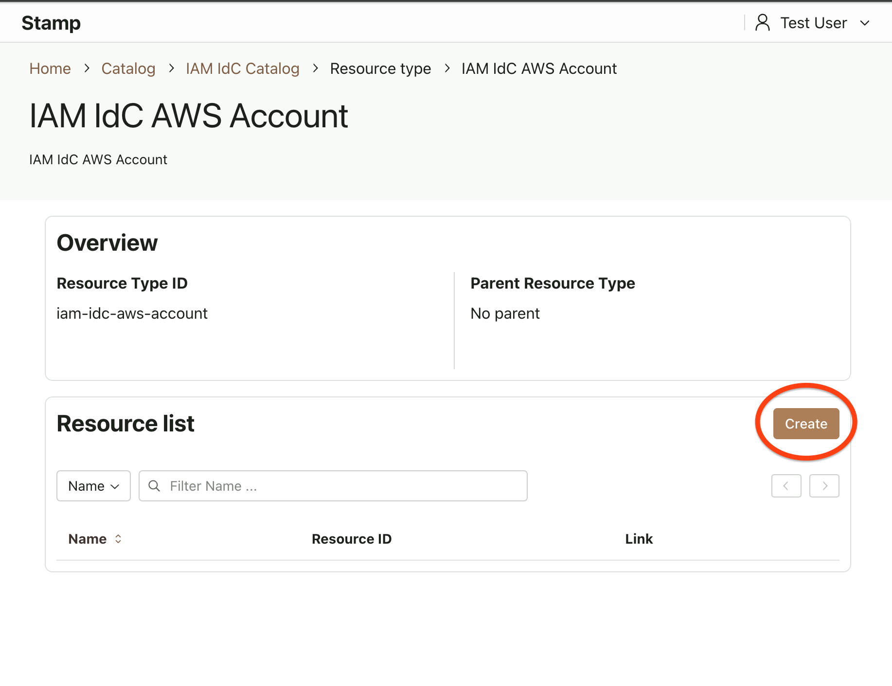
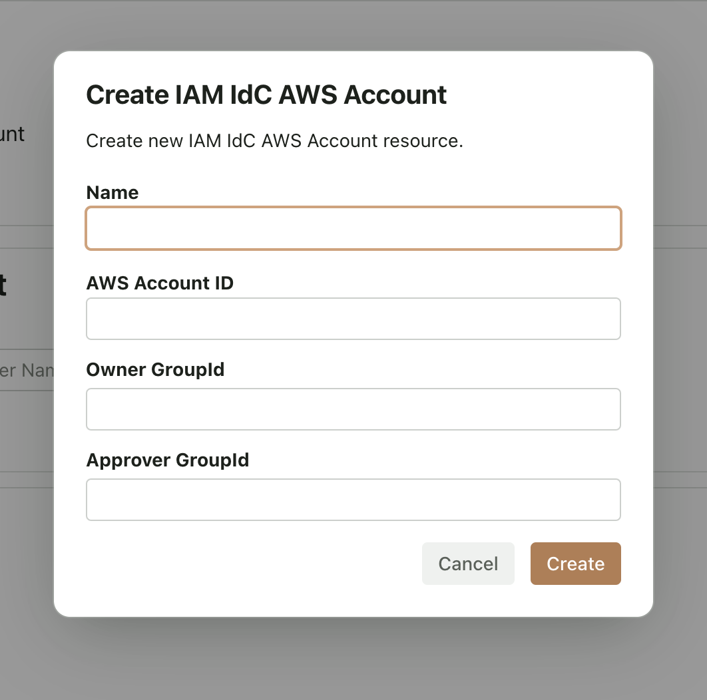
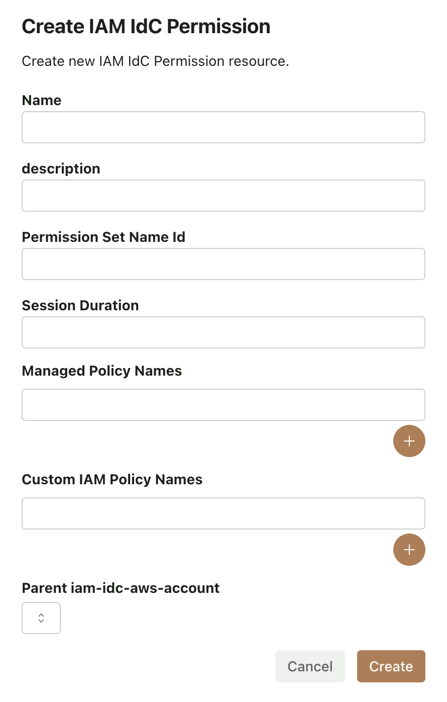
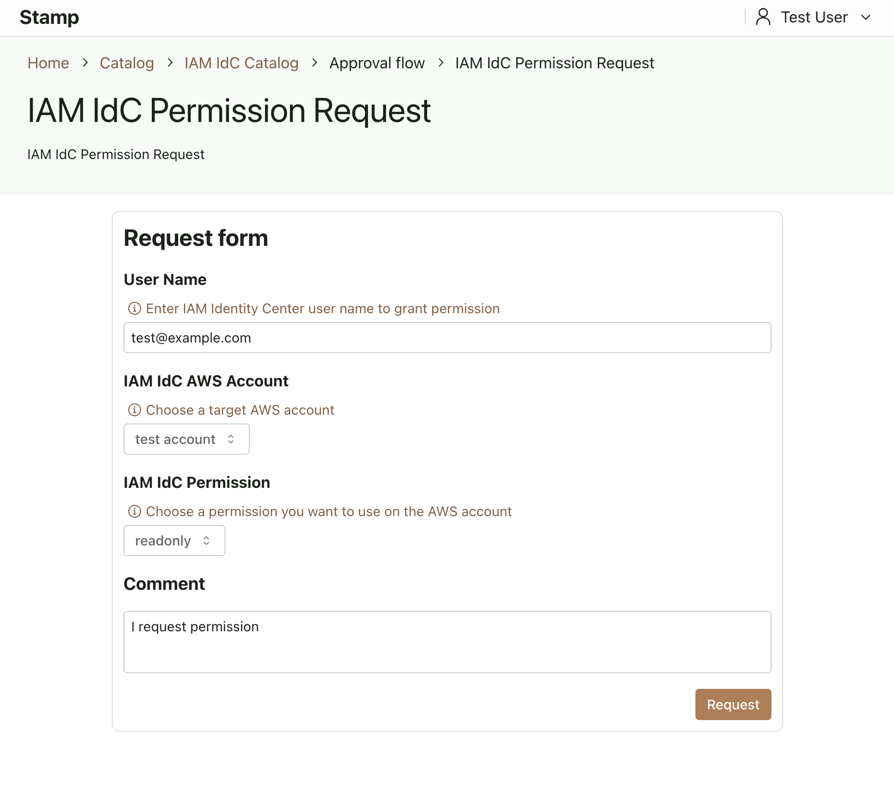
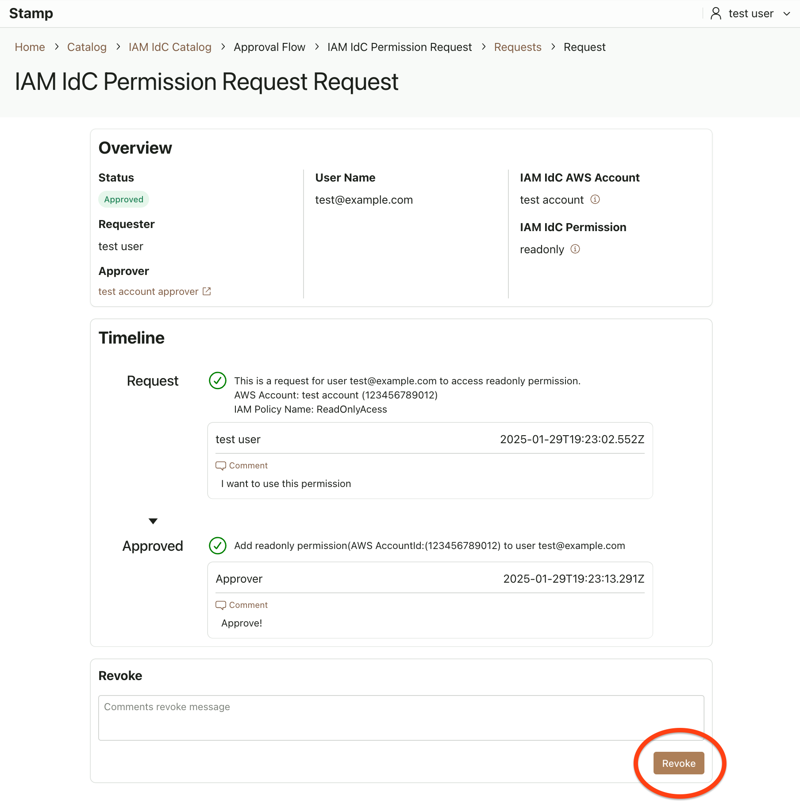

# How to Submit IAM IdC Catalog

This document introduces how to use the IAM Identity Center Catalog.

## Features

- You can create a PermissionSet for each AWS account in IAM Identity Center.
- PermissionSet can only register AWS Managed IAM Policies and Custom Managed IAM Policies.
- You can delegate Owner and Approver permissions for each AWS account.

**Note**

PermissionSet is created for each AWS account. Registration across multiple AWS accounts is not supported at this time.

## How to Register AWS Accounts

Users in the IAM IdC Catalog Owner Group can register AWS accounts under IAM Identity Center management.

1. Navigate to the page with the path `/catalog/iam-idc-catalog/resource-type/iam-idc-aws-account`.
2. Click **Create**.

   

3. Enter the required information.

   - **Owner GroupId** and **Approver GroupId** should specify the IDs of groups created in Stamp (which can be created on the `/group` page).

   

4. Click **Create**.

## How to Register Permissions

You can create PermissionSets for each AWS account using the following method:

1. Navigate to the page with the path `/catalog/iam-idc-catalog/resource-type/iam-idc-permission`.
2. Click **Create**.
3. Enter the required information:

   

| Property                     | Description                                                                      |
| ---------------------------- | -------------------------------------------------------------------------------- |
| Name                         | Name                                                                             |
| Description                  | Description                                                                      |
| Permission Set Name ID       | ID that becomes part of the PermissionSet name. Listed in the AWS Access Portal. |
| Session Duration             | Specify in the format PT8H.                                                      |
| Managed Policy Names         | AWS managed policy.                                                              |
| Custom IAM Policy Names      | Customer managed policy.                                                         |
| Parent `iam-idc-aws-account` | AWS account that provisions the PermissionSet.                                   |

## How to Submit a Request

You can submit requests using the following method:

1. Navigate to the page with the path `/catalog/iam-idc-catalog/approval-flow/iam-idc-permission-request/submit`.
2. Enter the details.
3. Click **Request**.

   

## How to Revoke

The requester or the Approver Group can revoke the request from the request page.

